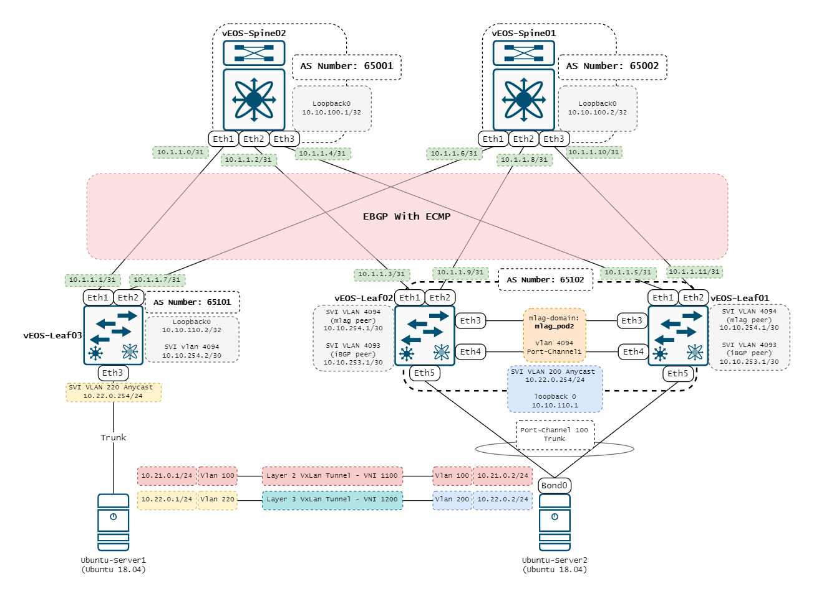

# Test Automation with Robotframework

## Introduction

Updating a network device is a necessity in a network operation. However, each software update, sometimes, carry new mechanism to configure a feature (i.e BGP, SNMP, etc.) which would cause network-wide issue when the update is applied to, even, a single network device.

Hence, a pre-update software testing is something users could explore especially if their network is already complex. Although, a small network could gain benefit for this practice too.

### Study Case

A small data center networking is a good study case to explore this idea more because it is small enough to model a small to medium enterprise network which only consist of 3-4 switches, but complex enough to simulate various technologies that is entailed in the network, such as BGP EVPN, VXLAN, etc. This is the data center network that has been built for this project:

All of these devices are virtual devices. Those devices are running inside [Virtualbox](https://www.virtualbox.org/wiki/Downloads). For Switches, Arista Virtual EOS (vEOS) version 4.28F is used, and the file can be downloaded in [Arista Network website](https://www.arista.com/en/). The installation guide can be found in [Arista community forum](https://aristanetworks.force.com/AristaCommunity/s/article/veos-and-virtualbox). 

The servers are running Ubuntu Server 18.04. Netplan is used to configure the network side of the server.

###### Note
Virtualbox and Arista installation will not be explained along with the topology setup with virtualbox. Please follow the link above.

## Projects
### Workflow
There are 3 main components on this project:
* Python
* Robot Framework
* YAML

Python is used to communicate with each switch and server through management interface, using SSH. Python is also used to send a set of instruction (i.e show command, configuration command, etc.) and gather its response to be parsed. Netmiko library is used to do all of this, and to parse the response Regex and string manipulation (i.e split, slice, etc.) are used.

The network and switches resources on the topology such as IP Address, MAC Address, Interface name, etc are modelled with YAML, which turning the network topology into a code. Here is a simple modelling from topology with yaml:

Robot Framework is used to assesed each output based on the desired test cases and automatically create test report in HTML format. Robot Framework is utilized to modularize the testing script, which ease up the modification and addition of test cases.

Here is a simple flow diagram for the project:

### Test Cases
Software testing require test case as a guideline about things that is wanted to be tested. In the feature that will be tested are:
* BGP Protocol
* BGP-EVPN address family
* Vxlan Interface
* Vxlan Bridging (Layer 2) Service
* Vxlan IRB Service
* Multi-Chassis Link Aggregation (MLAG)

All of the test cases of those features can be found in this [link]()

# How To Use
